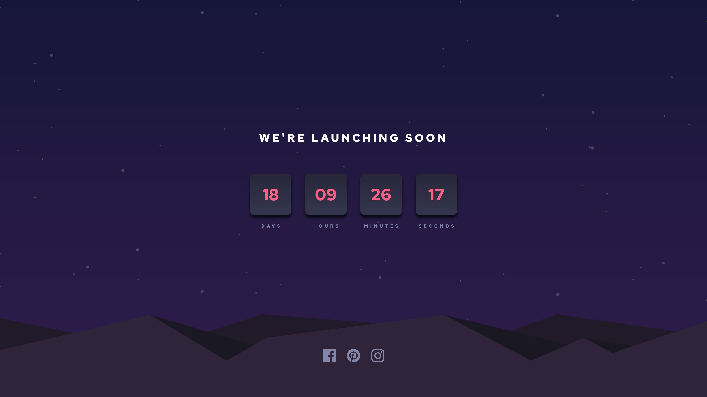

# Frontend Mentor - Launch countdown timer solution

This is a solution to the [Launch countdown timer challenge on Frontend Mentor](https://www.frontendmentor.io/challenges/launch-countdown-timer-N0XkGfyz-). Frontend Mentor challenges help you improve your coding skills by building realistic projects. 

## Table of contents

- [Overview](#overview)
  - [The challenge](#the-challenge)
  - [Screenshot](#screenshot)
  - [Links](#links)
- [My process](#my-process)
  - [Built with](#built-with)
  - [What I learned](#what-i-learned)
  - [Continued development](#continued-development)
  - [Useful resources](#useful-resources)
- [Author](#author)

## Overview

### The challenge

Users should be able to:

- See hover states for all interactive elements on the page
- See a live countdown timer that ticks down every second (start the count at 14 days)
- **Bonus**: When a number changes, make the card flip from the middle

### Screenshot

### Links

- Solution URL: [Add solution URL here](https://your-solution-url.com)
- Live Site URL: [Add live site URL here](https://your-live-site-url.com)

## My process

### Built with

- Semantic HTML5 markup
- Sass
- Flexbox
- CSS Grid
- Mobile-first workflow

### What I learned
- To combine a background image with a gradient. [How to combine a background image with a CSS 3 gradient](https://stackoverflow.com/questions/2504071/how-do-i-combine-a-background-image-and-css3-gradient-on-the-same-element)
- I took some inspiration from this code in this article. [Create a digital clock HTML, CSS, JavaScript](https://www.makeuseof.com/create-a-digital-clock-html-css-javascript/)
- I noticed some text-align issues while using letters-spacing. [How to fix this](https://stackoverflow.com/questions/21612058/letter-spacing-wrong-text-center-alignment)

### Continued development
- Alas, I couldn't implement the CSS flip clock, yet, as described in the bonus assignment: 
> **Bonus**: When a number changes, make the card flip from the middle.
- I'll probably create a React and/or Vue version of this app.

### Useful resources

- [CSS gradients generator](https://cssgradient.io/) 
- [HTML & CSS validator](https://validator.w3.org/nu/#textarea)

## Author

- Frontend Mentor - [@Aphelion-im](https://www.frontendmentor.io/profile/Aphelion-im)

